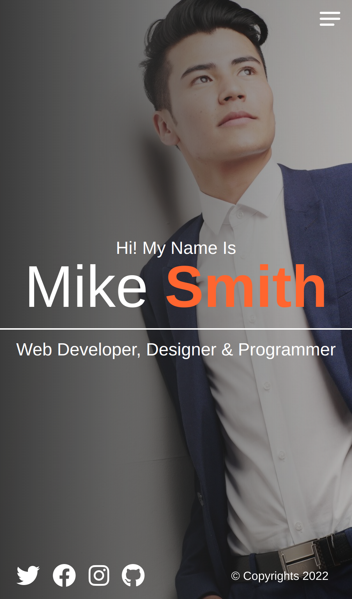
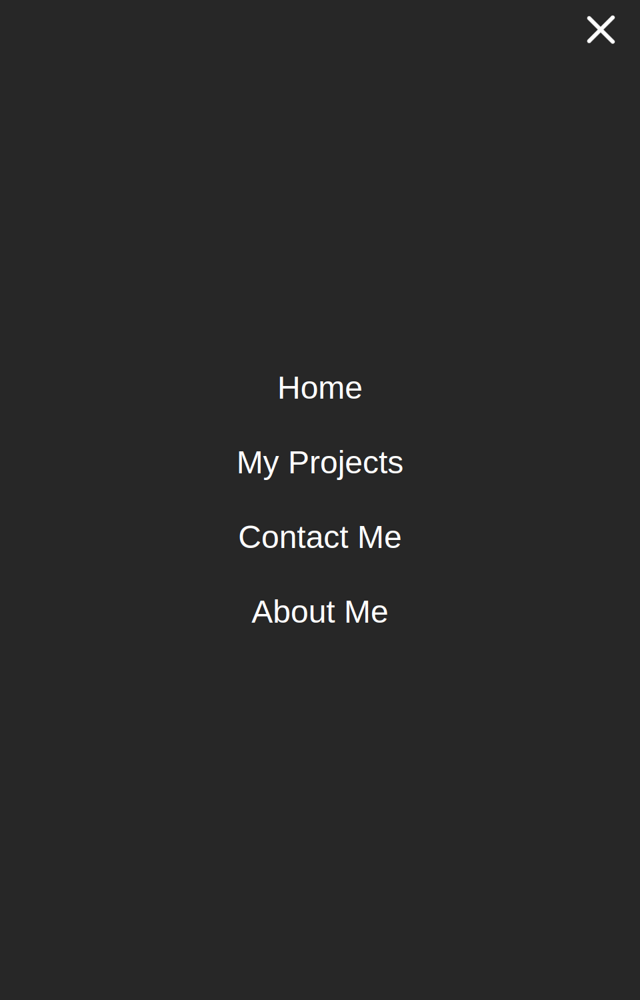
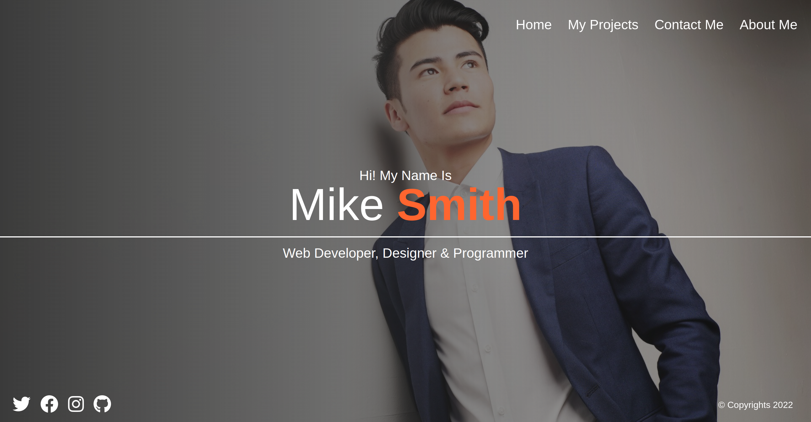
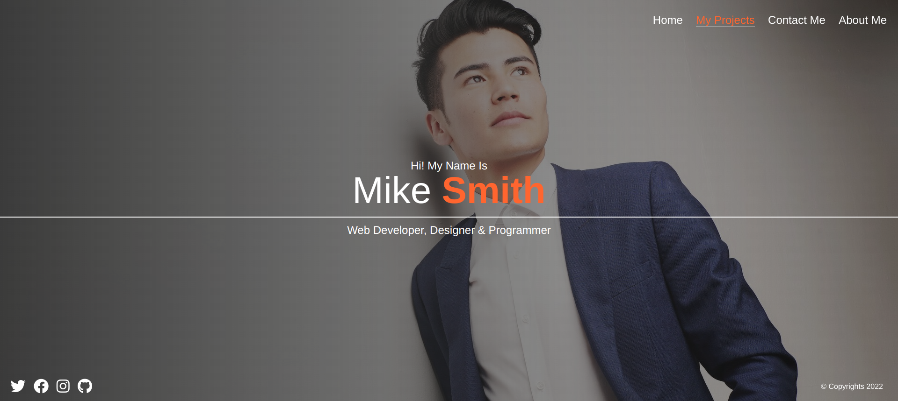

# Porfolio Solution using Sass only 

This is a solution to the Portfolio built using Sass . 

## Table of contents

- [Overview](#overview)
  - [The challenge](#the-challenge)
  - [Screenshot](#screenshot)
  - [Links](#links)
- [My process](#my-process)
  - [Built with](#built-with)
  - [What I learned](#what-i-learned)
  - [Continued development](#continued-development)
  - [Useful resources](#useful-resources)
- [Author](#author)
- [Acknowledgments](#acknowledgments)

## Overview

### The challenge

Users should be able to:

- View the optimal layout for the component depending on their device's screen size
- Hamburger Menu Using Vanilla Css
- Complete The Challenge Using Sass/Scss Only

### Screenshot

### Links

- Solution URL: [here](https://github.com/Valhalla-2/chat-app-)
- Live Site URL: [here](https://chat-app-to-frontend.netlify.app/)

## My process

### Built with

- Semantic HTML5 markup
- Sass custom properties
- Mobile-first workflow

### What I learned
[Sass](https://sass-lang.com/)

### Continued development
Achieve the layout with even lesser code if you can .

### Useful resources

- [Sass practice by FreeCodeCamp](https://www.freecodecamp.org/learn/front-end-development-libraries/sass/store-data-with-sass-variables)

## Author

- Github - [valhalla-2](https://github.com/Valhalla-2)
- Frontend Mentor - [@valhalla-2](https://www.frontendmentor.io/profile/Valhalla-2)

## Acknowledgments

Thanks to [codeStackr](https://www.youtube.com/codeSTACKr) for this helpful [video](https://www.youtube.com/watch?v=_a5j7KoflTs) for beginners .